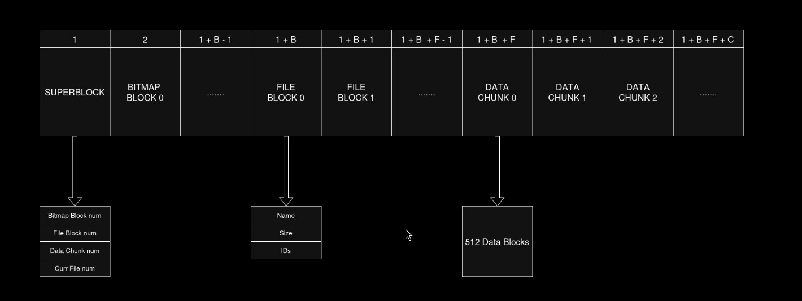

# PGFS File System Image Creator

A simple, educational file system generator that creates raw disk images with a straightforward block-based layout. PGFS (Pretty Good File System) is designed for learning, embedded systems, and situations where simplicity and predictability matter more than performance.

## Overview

PGFS creates self-contained file system images with a fixed layout that's easy to understand and implement. The file system uses a chunked allocation scheme where files are stored in 64 KB chunks, making it ideal for understanding basic file system concepts without the complexity of modern file systems.

## Motivation

**Why create another file system?**

- **Educational**: PGFS has a simple, flat structure that's easy to implement and understand. Perfect for OS development courses, bootloaders, or learning about file system internals.
- **Predictable**: Fixed block and chunk sizes with sequential allocation mean you always know where data lives. No fragmentation complexity, no journaling, no caching layers.
- **Embedded-Friendly**: The simple design works well in resource-constrained environments where you need reliable, straightforward file access.
- **Transparency**: The entire file system layout is documented in the output, making debugging and inspection trivial.

**Design Philosophy:**

PGFS favors simplicity over sophistication. There are no directories, no permissions, no timestamps, just files and their data. This makes it excellent for scenarios like:
- Boot images for custom operating systems
- Firmware update packages
- Teaching file system implementation

## Specifications

### Layout



```
[Superblock][Bitmap Blocks][FileBlocks][Data Chunks...]
```

### Constants

- **Block size**: 512 bytes
- **Chunk size**: 128 blocks = 64 KB (65,536 bytes)
- **Max chunks per file**: 246 (supports files up to ~15.6 MB)

### Structures

**Superblock** (512 bytes, padded):
- `uint32 B` - Number of bitmap blocks
- `uint32 F` - Maximum number of files
- `uint32 C` - Maximum number of chunks
- `uint32 N` - Current number of files

**FileBlock** (512 bytes):
- `char[16] name` - Null-terminated filename (max 15 chars)
- `uint32 size` - File size in bytes
- `uint16[246] chunks` - Array of chunk IDs (0 = unused)

**Bitmap**:
- 1 bit per chunk (1 = allocated, 0 = free)
- Rounded up to block boundaries

## Installation

```bash
chmod +x mkfs-pgfs.sh
```

No other dependencies required—just a standard Unix-like environment with bash.

## Usage

### Basic Usage

```bash
./mkfs-pgfs.sh file1.txt file2.bin file3.dat
```

This creates `ktfs.raw` containing the specified files.

### Custom Output File

```bash
./mkfs-pgfs.sh -o myimage.img file1.txt file2.bin
```

### Specify Limits

```bash
./mkfs-pgfs.sh -f 128 -c 512 -o large.img *.txt
```

- `-f, --max-files N`: Maximum number of files (default: 64)
- `-c, --max-chunks N`: Maximum number of chunks (default: 256)
- `-o, --output FILE`: Output filename (default: ktfs.raw)

### Full Example

```bash
# Create an image with up to 100 files and 1024 chunks
./mkfs-pgfs.sh -f 100 -c 1024 -o bootimage.img \
    kernel.bin \
    initrd.img \
    config.txt \
    drivers/*.sys
```

## Output

The tool provides detailed information about the created image:

```
=== GOONIX File System Creator ===
Output file:     ktfs.raw
Max files:       64
Max chunks:      256
Bitmap blocks:   1
FileBlock blocks: 64
Input files:     3

Processing files...
  file1.txt: 1234 bytes, 1 chunk(s) [0]
  file2.bin: 128000 bytes, 2 chunk(s) [1 2]
  
Total files: 2
Used chunks: 3 / 256

Layout:
  Superblock:   0x0000 - 0x01FF (512 bytes)
  Bitmap:       0x0200 - 0x03FF (512 bytes)
  FileBlocks:   0x0400 - 0x83FF (32768 bytes)
  Data Chunks:  0x8400 - 0x1008400 (16777216 bytes)

Files in image:
  [0] file1.txt         1234 bytes  chunks: 0
  [1] file2.bin       128000 bytes  chunks: 1 2
```

## Limitations

- **No directories**: All files are stored in a flat namespace
- **Filename length**: Maximum 15 characters (16th byte reserved for null terminator)
- **File size**: Maximum ~15.6 MB per file (246 chunks × 64 KB)
- **Sequential allocation**: Files are allocated chunks sequentially; no dynamic reallocation
- **No metadata**: No timestamps, permissions, or ownership information
- **Fixed size**: The image size is determined at creation time and cannot grow

## Reading PGFS Images

To implement a PGFS reader:

1. Read the superblock to get B, F, C, N values
2. Read the bitmap at offset `512` (size: `B × 512` bytes)
3. Read FileBlocks at offset `512 + B × 512` (F blocks of 512 bytes each)
4. Data chunks start at offset `512 + B × 512 + F × 512`
5. For each file, read its chunks using the chunk IDs from its FileBlock

Example offset calculations:
```
Superblock offset:    0
Bitmap offset:        512
FileBlock[i] offset:  512 + B × 512 + i × 512
Chunk[j] offset:      512 + B × 512 + F × 512 + j × 65536
```

## Use Cases

- **Bootable disk images** for custom operating systems (like ECE391)
- **Firmware bundles** containing multiple binary components
- **Educational projects** teaching file system concepts

---

**Note**: The script uses `/dev/zero` and `dd` for creating the image. On some systems, you may see warnings about partial reads. These are normal and can be safely ignored.

